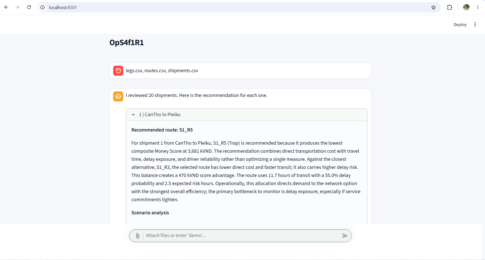

# Route Recommendation

**Chat with your logistics data — the bot picks the optimal route and explains why.**

## 📖 Overview

**OpS4f1R1** is a chat-based assistant that recommends the **optimal shipping route** from CSV data. Simply upload your logistics datasets in the chat interface, and the assistant automatically evaluates every candidate route using a monetized **Money Score**. It then selects the optimal route for each shipment and explains why it outperforms the alternatives based on **cost, travel time, delay risk, and driver reliability**.

The routing algorithm is implemented entirely with **Python** and **pandas**, making every recommendation deterministic, transparent, and fully reproducible. No machine learning model, GPU, or API key is required.

---

## 🎬 Demo

<p align="center">
  
</p>

---

## ⚙️ Environment Setup

Clone the repository:

```bash
git clone https://github.com/DOANHONGBAO/Optimizing-Shipment-Routes.git
cd Optimizing-Shipment-Routes
```

Create a virtual environment:

```bash
python -m venv .venv
```

Activate the environment:

**Linux / macOS**

```bash
source .venv/bin/activate
```

**Windows**

```bash
.venv\Scripts\activate
```

Install the required packages:

```bash
pip install -r requirements.txt
```

### Requirements

| Component | Version |
|-----------|----------|
| Python | ≥ 3.9 (3.10–3.12 recommended) |
| Streamlit | ≥ 1.43 |
| pandas | ≥ 2.0 |
| NumPy | ≥ 1.24 |
| Plotly | ≥ 5.20 |

Run the application:

```bash
streamlit run app.py
```

Open your browser and visit:

```
http://localhost:8501
```

---

## 📂 Sample Data

Download the sample datasets here:

https://drive.google.com/drive/folders/1W9nq14dkVKUZz46NKTmfQYSRQfafrG2h?usp=drive_link

If you don't have your own data, simply type:

```text
demo
```

The chatbot will automatically generate synthetic shipment and routing datasets for demonstration.

---

## 💬 Usage

1. Launch the Streamlit application.
2. Upload one or more CSV files:
   - `shipments.csv`
   - `routes.csv`
   - *(Optional)* `legs.csv`
3. Ask the chatbot to recommend the best shipping routes.
4. The assistant automatically:
   - Computes the **Money Score** for every candidate route.
   - Selects the optimal route for each shipment.
   - Displays a ranked comparison of all routes.
   - Explains why the selected route is optimal.
   - Visualizes the comparison with tables and charts.
   - Allows downloading the results as **CSV** or **JSON**.

No configuration is required.

---

## 📋 Input Data Schema

### shipments.csv

| Column | Description |
|--------|-------------|
| shipment_id | Shipment identifier |
| origin | Origin city |
| destination | Destination city |

### routes.csv

| Column | Description |
|--------|-------------|
| route_id | Route identifier |
| shipment_id | Shipment identifier |
| archetype | Route category |
| total_cost_kvnd | Total transportation cost (kVND) |
| total_time_h | Travel time (hours) |
| delay_probability | Probability of delay |
| expected_risk_hours | Expected delay duration |
| driver_score | Driver reliability score |

### legs.csv *(Optional)*

| Column | Description |
|--------|-------------|
| leg_id | Route segment identifier |
| route_id | Route identifier |
| from | Starting location |
| to | Destination |
| mode | Transportation mode |
| cost_kvnd | Segment cost |
| time_h | Segment travel time |
| delay_probability | Segment delay probability |
| risk_extra_h | Additional expected delay |

---

## ✨ Features

- 🤖 Chat-based logistics assistant
- 🚚 Automatic optimal route recommendation
- 💰 Deterministic Money Score evaluation
- 📊 Route ranking and comparison tables
- 📈 Interactive visualizations with Plotly
- 📝 Human-readable explanations for every recommendation
- 📥 Export results as CSV or JSON
- ⚡ Pure Python & pandas implementation
- 🔄 Fully reproducible routing decisions

---

## 📁 Project Structure

```text
Optimizing-Shipment-Routes/
│
├── assets/
│   └── demo.png
│
├── data/
│   ├── shipments.csv
│   ├── routes.csv
│   └── legs.csv
│
├── app.py
├── requirements.txt
├── README.md
└── ...
```

---

## 📄 License

This project is intended for educational and research purposes.